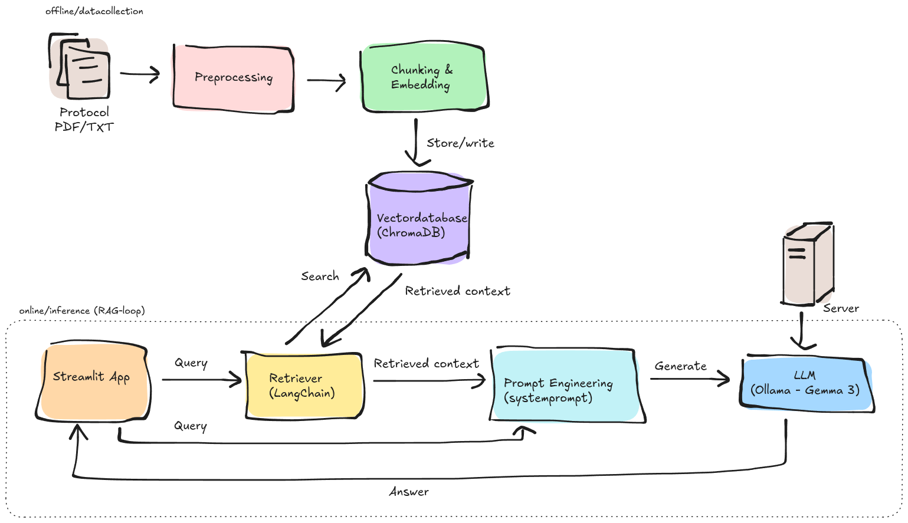
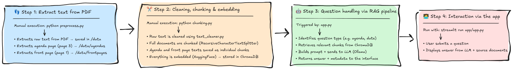

# Chatbot Project
A RAG-based chatbot for querying healthcare and welfare committee protocols using **Gemma 3** (via Ollama), LangChain, ChromaDB, and Streamlit.

## Language Note
This README is written in English to align with GitHub conventions and to make the project accessible to a broader audience. The code comments and additional documents (Discussion, Self-Evaluation, and Theoretical Questions) are in Swedish to match the course requirements. A brief Swedish summary is provided below.

## Svensk Sammanfattning
Detta projekt är en RAG-baserad chattbot för att söka i vård- och omsorgsnämndens protokoll i Sölvesborgs kommun. Lösningen använder lokal installation och open-source teknik (Gemma 3 via Ollama, LangChain, ChromaDB, Streamlit) för att göra den säker för känslig data, kostnadseffektiv och transparent. Projektet är utvecklat som en del av en kurs och demonstrerar hur AI kan förbättra informationsåtkomst i offentlig förvaltning. Koden är kommenterad på svenska, och ytterligare dokumentation (Diskussion, Självutvärdering, Teoretiska frågor) är också på svenska.

## Overview
This project, developed as part of a deep learning course, demonstrates an AI-powered chatbot designed to extract and present information from the healthcare and welfare committee's public protocols in Sölvesborg municipality. With a Retrieval-Augmented Generation (RAG) architecture, the chatbot provides quick and accurate answers to specific queries, aiming to enhance information accessibility and operational efficiency within public administration. The solution highlight the use of local and open-source technologies to ensure suitability for sensitive data, cost-effectiveness, and transparency.

## Features
* **Information Retrieval:** Answers questions based on the content of meeting protocols.
* **Date-Aware Filtering:** Filters protocols based on dates extracted from user queries.
* **Dedicated Agenda & Frontpage Handling:** Extracts and presents structured agenda and attendee information from protocols.
* **Text Preprocessing:** Text cleaning to optimize chunking and embedding quality.
* **User-Friendly Interface:** Built with Streamlit.
* **Local & Open-Source LLM:** Utilizes Gemma 3 (via Ollama) for data privacy and reduced reliance on external cloud services.

## Architecture


## Workflow


## Setup
1.  **Create and activate a virtual environment:** <br>
    `python -m venv .venv` <br>
    `source .venv/bin/activate` 
2.  **Install project dependencies:** <br>
    `pip install -r requirements.txt`
3.  **Install Ollama and download the LLM:** <br>
    Follow the instructions on [ollama.com](https://ollama.com/) to install Ollama for your OS.
    Download the Gemma 3 model: <br>`ollama pull gemma3:12b-it-qat`
4.  **Prepare your data:** <br>
    Place your protocol PDF files (unsigned, searchable PDFs) in the `./documents` directory.
5.  **Process documents and create vector embeddings:** <br>
    `python scripts/preprocess.py` <br>
    `python scripts/chunking.py`
6.  **Validate your RAG pipeline (Optional):** <br>
    If test questions are defined in `tests/validation_data.json`, run the evaluation script to assess performance (requires manual scoring): <br>
    `python scripts/evaluate.py`
7.  **Start the Ollama server:** <br>
    `ollama serve &` (or `ollama serve` in a dedicated terminal window)
8.  **Run the Streamlit application:** <br>
    `streamlit run app/app.py`

## Requirements
* Python 3.12 (or compatible)
* CUDA 12.2 (recommended for GPU acceleration, if applicable)
* Ollama with **Gemma 3 (gemma3:12b-it-qat)** model.
* Dependencies listed in requirements.txt (e.g., Streamlit, LangChain, PyMuPDF, PyYAML)

## Project Structure
```
.
├── app/                            # Streamlit application
│   ├── static/                     # Static files (e.g., Sölvesborg logo)
│   └── app.py                      # Main Streamlit app file
├── config/
│   └── config.yaml                 # Configuration for LLM, chunking and paths
├── data/                           # Preprocessed text files
│   ├── agendas/                    # Extracted agenda pages (.txt)
│   ├── chroma_db/                  # Chroma vector database
│   └── frontpages/                 # Extracted frontpages (.txt)
├── documents/                      # Input PDF protocol files
├── results/                        # Documentation and diagrams (Discussion, Self-Evaluation, Theoretical Questions, RAG.png, workflow.png)
├── scripts/
│   ├── chunking.py                 # Text chunking and embedding creation
│   ├── preprocess.py               # Text extraction from PDFs
│   ├── rag_pipeline.py             # RAG query logic
│   └── text_cleaner.py             # Text cleaning utilities
├── tests/                          
│   ├── evaluate.py                 # Pipeline evaluation script
│   ├── validation_data.json        # Test questions with expected answers
│   └── evaluation_results.json     # Evaluation results
├── .venv/                          # Python virtual environment
├── .gitignore                      
├── requirements.txt                # Python dependencies
└── README.md                       # This file
```
## Future Improvements
* Optimize `chunk_size` and `overlap` for better retrieval accuracy.
* Fine-tuning the system prompt to handle complex queries.
* Support embedded documents/attachments in protocols.
* Automate ChromaDB updates for new protocols.
* Test larger embedding models on server hardware for improved precision.
* Conduct user evaluation to identify additional areas for improvement.

